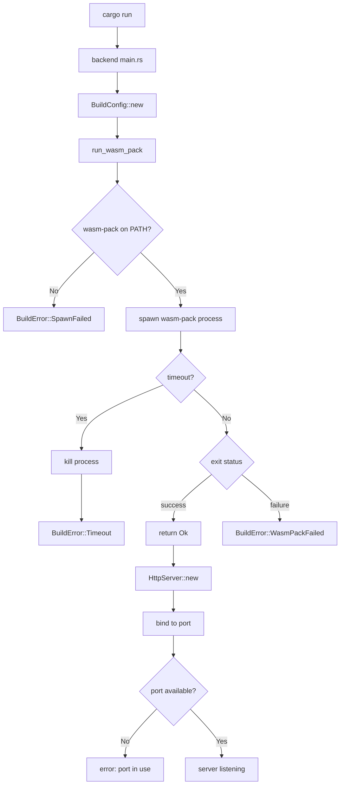

# Stage 1 — Static Build Pipeline

**Implementation Plan for flux-wasm-builder**

---

## Overview

Stage 1 implements the build subsystem's core function: invoking `wasm-pack` as a subprocess, streaming its output to the terminal in real time, and returning a typed `Result`. This stage wires the build subsystem into `backend/src/main.rs` so that `cargo run` triggers a frontend build before the Actix server binds.

**Key Behavior:**
- On startup, the backend invokes `wasm-pack build frontend/ --target web --dev`
- stdout and stderr from wasm-pack are streamed directly to the parent process
- A 300-second default timeout prevents indefinite hangs
- Build failure at startup exits the process with a non-zero code
- The server is not started if the initial build fails

---

## Architecture

### Component Diagram

```
cargo run (in generated project)
  └─► backend/src/main.rs  [#[actix_web::main]]
        ├─► BuildConfig::new("../frontend")
        ├─► run_wasm_pack(&config).await
        │     ├─► tokio::process::Command::new("wasm-pack")
        │     │     .args(["build", "--target", "web", "--dev"])
        │     │     .stdout(Stdio::inherit())
        │     │     .stderr(Stdio::inherit())
        │     │     .arg(&config.frontend_crate_path)
        │     ├─► tokio::time::timeout(Duration::from_secs(300), child.wait())
        │     └─► On timeout: child.kill().await
        └─► If build succeeded: HttpServer::new(...).bind(...)
              Else: exit(1)
```

### File Structure After Stage 1

```
flux-wasm-builder/
├── src/
│   ├── lib.rs                    # Add build module export
│   ├── build/
│   │   ├── mod.rs                # Build subsystem module
│   │   └── build.rs              # wasm-pack invocation logic
│   └── ... (existing files)
└── tests/
    └── build.rs                  # Integration tests for build subsystem

Generated project backend:
├── backend/src/
│   ├── main.rs                   # Updated to call build subsystem
│   └── build_subsystem/
│       ├── mod.rs                # Updated exports
│       └── build.rs              # Implemented (no longer stub)
```

---

## Implementation Steps

### Step 1: Create Build Module in Tool Crate

**File: `src/build/mod.rs`**

Create the build module that will contain the wasm-pack invocation logic:

```rust
// src/build/mod.rs

mod build;

pub use build::{BuildConfig, BuildError, run_wasm_pack, run_wasm_pack_with_env, run_command_with_timeout};
```

### Step 2: Define BuildConfig Struct

**File: `src/build/build.rs`**

Define the configuration struct with defaults:

```rust
use std::path::{Path, PathBuf};
use std::time::Duration;

/// Configuration for the build subsystem.
#[derive(Clone, Debug)]
pub struct BuildConfig {
    /// Path to the frontend crate directory (e.g., "../frontend")
    pub frontend_crate_path: PathBuf,
    /// Path to the pkg output directory (default: frontend_crate_path + "/pkg")
    pub pkg_output_path: PathBuf,
    /// Path to index.html (default: frontend_crate_path + "/index.html")
    pub index_html_path: PathBuf,
    /// Watch debounce interval in milliseconds (default: 300)
    pub watch_debounce_ms: u64,
    /// WebSocket path for reload signaling (default: "/ws/reload")
    pub reload_ws_path: String,
    /// Server port (default: 8080)
    pub port: u16,
    /// Build timeout in seconds (default: 300)
    pub build_timeout_secs: u64,
}

impl BuildConfig {
    /// Create a new BuildConfig with the given frontend crate path.
    /// All other fields are set to reasonable defaults.
    pub fn new<P: Into<PathBuf>>(frontend_crate_path: P) -> Self {
        let frontend_crate_path = frontend_crate_path.into();
        Self {
            pkg_output_path: frontend_crate_path.join("pkg"),
            index_html_path: frontend_crate_path.join("index.html"),
            watch_debounce_ms: 300,
            reload_ws_path: "/ws/reload".to_string(),
            port: 8080,
            build_timeout_secs: 300,
            frontend_crate_path,
        }
    }
}
```

### Step 3: Define BuildError Enum

**File: `src/build/build.rs`**

Define the error type per the instrumentation spec:

```rust
/// Error type for build failures.
#[derive(Debug, thiserror::Error)]
pub enum BuildError {
    /// wasm-pack exited with a non-zero status.
    /// exit_code is None when the process was killed by a signal.
    #[error("wasm-pack failed (exit code: {exit_code:?})")]
    WasmPackFailed { exit_code: Option<i32> },

    /// Build timed out and the child process was killed.
    #[error("wasm-pack timed out after {secs}s")]
    Timeout { secs: u64 },

    /// The wasm-pack binary could not be found or spawned.
    #[error("failed to spawn wasm-pack: {source}")]
    SpawnFailed { source: std::io::Error },

    /// Waiting on the child process failed (OS error).
    #[error("failed to wait on wasm-pack process: {source}")]
    WaitFailed { source: std::io::Error },

    /// Killing the timed-out process failed. Build is still considered failed.
    #[error("failed to kill timed-out wasm-pack process: {source}")]
    KillFailed { source: std::io::Error },
}
```

### Step 4: Implement run_wasm_pack Functions

**File: `src/build/build.rs`**

Implement the core build functions with full tracing instrumentation:

```rust
use tokio::process::Command;
use std::process::Stdio;

/// Run wasm-pack build with the given configuration.
pub async fn run_wasm_pack(config: &BuildConfig) -> Result<(), BuildError> {
    run_wasm_pack_with_env(config, &[]).await
}

/// Run wasm-pack build with additional environment variables.
/// 
/// This function is exposed for testing purposes, allowing tests to 
/// shadow PATH without affecting the system environment.
pub async fn run_wasm_pack_with_env(
    config: &BuildConfig,
    extra_env: &[(&str, &str)],
) -> Result<(), BuildError> {
    let span = tracing::info_span!(
        "wasm_pack_build",
        frontend = %config.frontend_crate_path.display(),
        timeout_secs = config.build_timeout_secs,
    );
    let _enter = span.enter();

    tracing::info!("starting wasm-pack build");

    let mut cmd = Command::new("wasm-pack");
    cmd.args(["build", "--target", "web"])
        .arg(&config.frontend_crate_path)
        .stdout(Stdio::inherit())
        .stderr(Stdio::inherit());

    // Apply dev mode flag (in release builds, use --release)
    #[cfg(debug_assertions)]
    cmd.arg("--dev");
    #[cfg(not(debug_assertions))]
    cmd.arg("--release");

    for (k, v) in extra_env {
        cmd.env(k, v);
    }

    let mut child = cmd.spawn().map_err(|e| {
        tracing::error!(error = %e, "failed to spawn wasm-pack");
        BuildError::SpawnFailed { source: e }
    })?;

    let timeout = Duration::from_secs(config.build_timeout_secs);
    match tokio::time::timeout(timeout, child.wait()).await {
        Ok(Ok(status)) if status.success() => {
            tracing::info!("wasm-pack build succeeded");
            Ok(())
        }
        Ok(Ok(status)) => {
            let exit_code = status.code();
            tracing::error!(?exit_code, "wasm-pack build failed");
            Err(BuildError::WasmPackFailed { exit_code })
        }
        Ok(Err(e)) => {
            tracing::error!(error = %e, "error waiting on wasm-pack process");
            Err(BuildError::WaitFailed { source: e })
        }
        Err(_elapsed) => {
            tracing::error!(
                timeout_secs = config.build_timeout_secs,
                "wasm-pack timed out — killing process"
            );
            if let Err(e) = child.kill().await {
                tracing::warn!(error = %e, "failed to kill timed-out wasm-pack process");
                return Err(BuildError::KillFailed { source: e });
            }
            Err(BuildError::Timeout { secs: config.build_timeout_secs })
        }
    }
}

/// Testable primitive for timeout behavior.
/// 
/// This function allows testing timeout behavior with any command,
/// not just wasm-pack.
pub async fn run_command_with_timeout(
    mut cmd: Command,
    timeout: Duration,
) -> Result<(), BuildError> {
    let mut child = cmd.spawn()
        .map_err(|e| BuildError::SpawnFailed { source: e })?;

    match tokio::time::timeout(timeout, child.wait()).await {
        Ok(Ok(status)) if status.success() => Ok(()),
        Ok(Ok(status)) => Err(BuildError::WasmPackFailed { exit_code: status.code() }),
        Ok(Err(e)) => Err(BuildError::WaitFailed { source: e }),
        Err(_elapsed) => {
            let _ = child.kill().await; // best-effort; process is already considered failed
            Err(BuildError::Timeout { secs: timeout.as_secs() })
        }
    }
}
```

### Step 5: Update Library Entry Point

**File: `src/lib.rs`**

Add the build module to the library exports:

```rust
// src/lib.rs

// module declarations
pub mod build;
pub mod env_check;
pub mod init;

// Re-exports for convenience
pub use build::{BuildConfig, BuildError};
pub use env_check::EnvCheckError;
pub use init::{scaffold, InitError};
```

### Step 6: Update Generated Backend Templates

**File: `src/init/templates.rs`**

Update the backend `build.rs` template (already implemented in Stage 0, verify it's correct):

```rust
/// Backend build_subsystem/build.rs
pub fn backend_build_subsystem_build_rs() -> &'static str {
    r#"use std::path::Path;
use std::time::Duration;
use std::process::Stdio;
use tokio::process::Command;

/// Error type for build failures.
#[derive(Debug, thiserror::Error)]
pub enum BuildError {
    #[error("wasm-pack failed (exit code: {exit_code:?})")]
    WasmPackFailed { exit_code: Option<i32> },

    #[error("wasm-pack timed out after {secs}s")]
    Timeout { secs: u64 },

    #[error("failed to spawn wasm-pack: {source}")]
    SpawnFailed { source: std::io::Error },

    #[error("failed to wait on wasm-pack process: {source}")]
    WaitFailed { source: std::io::Error },

    #[error("failed to kill timed-out wasm-pack process: {source}")]
    KillFailed { source: std::io::Error },
}

/// Configuration for the build subsystem.
#[derive(Clone, Debug)]
pub struct BuildConfig {
    pub frontend_crate_path: std::path::PathBuf,
    pub pkg_output_path: std::path::PathBuf,
    pub index_html_path: std::path::PathBuf,
    pub watch_debounce_ms: u64,
    pub reload_ws_path: String,
    pub port: u16,
    pub build_timeout_secs: u64,
}

impl BuildConfig {
    pub fn new<P: Into<std::path::PathBuf>>(frontend_crate_path: P) -> Self {
        let frontend_crate_path = frontend_crate_path.into();
        Self {
            pkg_output_path: frontend_crate_path.join("pkg"),
            index_html_path: frontend_crate_path.join("index.html"),
            watch_debounce_ms: 300,
            reload_ws_path: "/ws/reload".to_string(),
            port: 8080,
            build_timeout_secs: 300,
            frontend_crate_path,
        }
    }
}

/// Run wasm-pack build with the given configuration.
pub async fn run_wasm_pack(config: &BuildConfig) -> Result<(), BuildError> {
    run_wasm_pack_with_env(config, &[]).await
}

/// Run wasm-pack build with additional environment variables.
pub async fn run_wasm_pack_with_env(
    config: &BuildConfig,
    extra_env: &[(&str, &str)],
) -> Result<(), BuildError> {
    let span = tracing::info_span!(
        "wasm_pack_build",
        frontend = %config.frontend_crate_path.display(),
        timeout_secs = config.build_timeout_secs,
    );
    let _enter = span.enter();

    tracing::info!("starting wasm-pack build");

    let mut cmd = Command::new("wasm-pack");
    cmd.args(["build", "--target", "web"])
        .arg(&config.frontend_crate_path)
        .stdout(Stdio::inherit())
        .stderr(Stdio::inherit());

    #[cfg(debug_assertions)]
    cmd.arg("--dev");
    #[cfg(not(debug_assertions))]
    cmd.arg("--release");

    for (k, v) in extra_env {
        cmd.env(k, v);
    }

    let mut child = cmd.spawn().map_err(|e| {
        tracing::error!(error = %e, "failed to spawn wasm-pack");
        BuildError::SpawnFailed { source: e }
    })?;

    let timeout = Duration::from_secs(config.build_timeout_secs);
    match tokio::time::timeout(timeout, child.wait()).await {
        Ok(Ok(status)) if status.success() => {
            tracing::info!("wasm-pack build succeeded");
            Ok(())
        }
        Ok(Ok(status)) => {
            let exit_code = status.code();
            tracing::error!(?exit_code, "wasm-pack build failed");
            Err(BuildError::WasmPackFailed { exit_code })
        }
        Ok(Err(e)) => {
            tracing::error!(error = %e, "error waiting on wasm-pack process");
            Err(BuildError::WaitFailed { source: e })
        }
        Err(_elapsed) => {
            tracing::error!(
                timeout_secs = config.build_timeout_secs,
                "wasm-pack timed out — killing process"
            );
            if let Err(e) = child.kill().await {
                tracing::warn!(error = %e, "failed to kill timed-out wasm-pack process");
                return Err(BuildError::KillFailed { source: e });
            }
            Err(BuildError::Timeout { secs: config.build_timeout_secs })
        }
    }
}

/// Testable primitive for timeout behavior.
pub async fn run_command_with_timeout(
    mut cmd: Command,
    timeout: Duration,
) -> Result<(), BuildError> {
    let mut child = cmd.spawn()
        .map_err(|e| BuildError::SpawnFailed { source: e })?;

    match tokio::time::timeout(timeout, child.wait()).await {
        Ok(Ok(status)) if status.success() => Ok(()),
        Ok(Ok(status)) => Err(BuildError::WasmPackFailed { exit_code: status.code() }),
        Ok(Err(e)) => Err(BuildError::WaitFailed { source: e }),
        Err(_elapsed) => {
            let _ = child.kill().await;
            Err(BuildError::Timeout { secs: timeout.as_secs() })
        }
    }
}
"#
}
```

### Step 7: Update Generated Backend main.rs Template

**File: `src/init/templates.rs`**

Update the backend main.rs to call the build subsystem:

```rust
/// Backend main.rs
pub fn backend_main_rs() -> &'static str {
    r#"use actix_web::{web, App, HttpServer};
use tracing_subscriber::{fmt, EnvFilter};

mod build_subsystem;
mod api;

use build_subsystem::build::{BuildConfig, run_wasm_pack, BuildError};

#[actix_web::main]
async fn main() -> Result<(), Box<dyn std::error::Error>> {
    init_tracing();

    let config = BuildConfig::new("../frontend");
    let port = config.port;

    // Run initial frontend build before starting server
    tracing::info!("running initial frontend build");
    if let Err(e) = run_wasm_pack(&config).await {
        eprintln!("error: initial build failed: {e}");
        std::process::exit(1);
    }

    let server = HttpServer::new(move || {
        App::new()
            .configure(api::configure)
            // Static assets and SPA fallback will be added in Stage 2
    })
    .bind(("127.0.0.1", port));

    match server {
        Ok(s) => {
            tracing::info!(port, "server listening");
            s.run().await?;
        }
        Err(e) if e.kind() == std::io::ErrorKind::AddrInUse => {
            eprintln!("error: port {port} is already in use. Change the port in BuildConfig.");
            std::process::exit(1);
        }
        Err(e) => return Err(e.into()),
    }

    Ok(())
}

fn init_tracing() {
    fmt()
        .with_env_filter(
            EnvFilter::try_from_default_env()
                .unwrap_or_else(|_| EnvFilter::new("info"))
        )
        .with_target(false)
        .compact()
        .init();
}
"#
}
```

### Step 8: Update Generated build_subsystem/mod.rs Template

**File: `src/init/templates.rs`**

Update the module exports:

```rust
/// Backend build_subsystem/mod.rs
pub fn backend_build_subsystem_mod() -> &'static str {
    r#"pub mod build;
pub mod build_coordinator;
pub mod watcher;
pub mod reload;
pub mod static_assets;

pub use build::{BuildConfig, BuildError, run_wasm_pack};
"#
}
```

### Step 9: Write Unit Tests

**File: `src/build/build.rs` (test module)**

```rust
#[cfg(test)]
mod tests {
    use super::*;
    use tempfile::tempdir;

    #[test]
    fn build_config_default_pkg_path_is_relative_to_frontend() {
        let config = BuildConfig::new(PathBuf::from("../frontend"));
        assert_eq!(config.pkg_output_path, PathBuf::from("../frontend/pkg"));
    }

    #[test]
    fn build_config_default_index_html_path_is_relative_to_frontend() {
        let config = BuildConfig::new(PathBuf::from("../frontend"));
        assert_eq!(config.index_html_path, PathBuf::from("../frontend/index.html"));
    }

    #[test]
    fn build_config_default_timeout_is_300_seconds() {
        let config = BuildConfig::new("../frontend");
        assert_eq!(config.build_timeout_secs, 300);
    }

    #[test]
    fn build_config_default_port_is_8080() {
        let config = BuildConfig::new("../frontend");
        assert_eq!(config.port, 8080);
    }

    #[tokio::test]
    async fn returns_error_when_wasm_pack_not_on_path() {
        let config = BuildConfig::new("/nonexistent");
        let result = run_wasm_pack_with_env(&config, &[("PATH", "")]).await;
        assert!(result.is_err());
    }

    #[tokio::test]
    async fn returns_wasm_pack_failed_for_invalid_crate_path() {
        let dir = tempdir().unwrap();
        let config = BuildConfig::new(dir.path());
        let result = run_wasm_pack(&config).await;
        assert!(matches!(result, Err(BuildError::WasmPackFailed { .. })));
    }

    #[tokio::test]
    async fn returns_timeout_error_when_process_hangs() {
        let mut cmd = Command::new("sleep");
        cmd.arg("60");
        let result = run_command_with_timeout(
            cmd,
            Duration::from_millis(100)
        ).await;
        assert!(matches!(result, Err(BuildError::Timeout { .. })));
    }

    #[tokio::test]
    async fn returns_success_for_fast_command() {
        let mut cmd = Command::new("echo");
        cmd.arg("test");
        let result = run_command_with_timeout(
            cmd,
            Duration::from_secs(5)
        ).await;
        assert!(result.is_ok());
    }
}
```

### Step 10: Write Integration Tests

**File: `tests/build.rs`**

```rust
// Run with: RUN_WASM_TESTS=1 cargo test --test build

fn wasm_tests_enabled() -> bool {
    std::env::var("RUN_WASM_TESTS").is_ok()
}

#[test]
fn wasm_pack_builds_scaffolded_frontend() {
    if !wasm_tests_enabled() { return; }

    let dir = tempfile::tempdir().unwrap();
    
    // Scaffold the project
    assert_cmd::Command::cargo_bin("flux-wasm-builder").unwrap()
        .args(["init", "test-app"])
        .current_dir(dir.path())
        .assert().success();

    // Run wasm-pack on the frontend
    let status = std::process::Command::new("wasm-pack")
        .args(["build", "--target", "web", "--dev"])
        .current_dir(dir.path().join("test-app/frontend"))
        .status()
        .expect("failed to invoke wasm-pack");

    assert!(status.success());
    assert!(dir.path().join("test-app/frontend/pkg").exists());
}

#[test]
fn generated_backend_cargo_run_fails_gracefully_without_pkg() {
    // This test verifies that cargo run in a freshly scaffolded project
    // fails gracefully when wasm-pack hasn't been run yet
    // (The build should fail, not panic)
    let dir = tempfile::tempdir().unwrap();
    
    assert_cmd::Command::cargo_bin("flux-wasm-builder").unwrap()
        .args(["init", "test-app"])
        .current_dir(dir.path())
        .assert().success();

    // Note: This test would require actually running cargo in the generated
    // project, which is slow. It's marked as a manual test for now.
}
```

---

## Test-Driven Development Workflow

Following the spec's TDD approach:

1. **Write tests first** — Create all unit and integration tests
2. **Confirm tests fail** — Run `cargo test` and verify failures
3. **Implement** — Write code until all tests pass
4. **Manual verification** — Run the tool and verify end-to-end behavior

---

## Acceptance Criteria

- [ ] All unit tests pass
- [ ] `run_wasm_pack_with_env` with an empty `PATH` returns `Err`
- [ ] `run_wasm_pack` pointed at an empty directory returns `Err(BuildError::WasmPackFailed)`
- [ ] `run_command_with_timeout` with a long-running command and a short timeout returns `Err(BuildError::Timeout)`
- [ ] When `RUN_WASM_TESTS=1`, the integration test confirms a scaffolded frontend builds successfully
- [ ] `cargo run` in a scaffolded project builds the frontend, starts the server, and exits non-zero if the build fails

---

## Dependencies Summary

### Tool Dependencies (additions for Stage 1)

| Crate   | Purpose                    |
| ------- | -------------------------- |
| `tokio` | Async process spawning     |

Add to `Cargo.toml`:

```toml
[dependencies]
tokio = { version = "1", features = ["process", "time", "rt", "rt-multi-thread"] }
```

### Generated Backend Dependencies (already present from Stage 0)

| Crate   | Purpose                |
| ------- | ---------------------- |
| `tokio` | Async runtime, process |
| `tracing` | Structured logging   |

---

## File Checklist

### Tool Files to Create/Modify

- [ ] `src/build/mod.rs` — New module declaration
- [ ] `src/build/build.rs` — Build logic implementation
- [ ] `src/lib.rs` — Add build module export
- [ ] `tests/build.rs` — Integration tests

### Template Files to Update

- [ ] `src/init/templates.rs`:
  - [ ] `backend_build_subsystem_build_rs()` — Full implementation (replace stub)
  - [ ] `backend_main_rs()` — Updated to call build subsystem
  - [ ] `backend_build_subsystem_mod()` — Updated exports

---

## Notes

1. **First-run latency:** The first `wasm-pack` invocation on a fresh project downloads the entire Yew dependency tree, which may take several minutes. The 300-second timeout is intentionally generous.

2. **Stdio inheritance:** `stdout(Stdio::inherit())` and `stderr(Stdio::inherit())` ensure compiler output flows directly to the terminal without buffering or filtering.

3. **Exit code handling:** `exit_code` is `Option<i32>` because a process killed by a signal has no exit code on Unix.

4. **Timeout behavior:** On timeout, the child process is killed before returning `BuildError::Timeout`. If `kill()` itself fails, `BuildError::KillFailed` is returned.

5. **Dev vs Release mode:** The `#[cfg(debug_assertions)]` attribute determines whether `--dev` or `--release` is passed to wasm-pack. This matches the build profile of the backend itself.

---

## Mermaid Diagram: Build Flow



---

## Next Steps After Stage 1

Stage 2 will add:
- Static file serving for `pkg/` contents
- SPA fallback to `index.html`
- Path traversal protection
- MIME type handling

Stage 3 will add:
- File watching with `notify-debouncer-mini`
- Build coordinator loop
- WebSocket live reload
