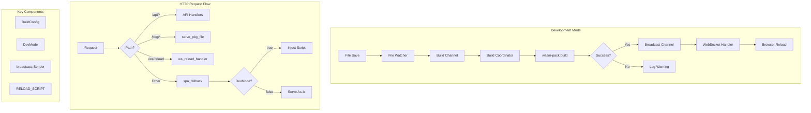

# Stage 4 — Live Reload Implementation Plan

**Status:** Planning Complete  
**Prerequisites:** Stages 0-3 (All Complete)

---

## 1. Executive Summary

Stage 4 adds WebSocket-based live reload functionality to the development server. When a developer saves a Rust source file in the frontend crate, after a successful rebuild, all connected browser tabs automatically refresh. This creates a seamless development experience where changes are immediately visible without manual browser refresh.

### Key Deliverables

1. **Reload Module** (`reload.rs`) — WebSocket handler and script injection
2. **DevMode Flag** — Distinguishes development from release mode
3. **Broadcast Channel Integration** — Signals successful rebuilds to WebSocket handlers
4. **Script Injection** — Dynamically injects reload script into `index.html` in dev mode
5. **Feature Gating** — Compiles out WebSocket endpoint in release/embed-assets mode

---

## 2. Current State Analysis

### What Exists

| Component | Location | Status |
|-----------|----------|--------|
| Build Pipeline | [`src/build/build.rs`](src/build/build.rs) | ✅ Complete |
| Build Coordinator | [`src/build/build_coordinator.rs`](src/build/build_coordinator.rs) | ✅ Complete (needs broadcast integration) |
| File Watcher | [`src/build/watcher.rs`](src/build/watcher.rs) | ✅ Complete |
| Static Assets | [`src/build/static_assets.rs`](src/build/static_assets.rs) | ✅ Complete (needs script injection) |
| Module Exports | [`src/build/mod.rs`](src/build/mod.rs) | ⚠️ Missing `reload` module |
| Templates | [`src/init/templates.rs`](src/init/templates.rs) | ⚠️ References `reload` module as stub |

### What Is Missing

1. **`src/build/reload.rs`** — Does not exist
2. **`DevMode` struct** — Not defined anywhere
3. **Broadcast channel** — Not integrated into `run_build_loop`
4. **Script injection** — Not implemented in `spa_fallback`
5. **WebSocket route** — Not registered in templates or main.rs
6. **`actix-ws` dependency** — Listed in templates but not in tool's Cargo.toml

---

## 3. Implementation Steps

### Step 3.1: Add Missing Dependencies

**File:** [`Cargo.toml`](Cargo.toml)

Add `actix-ws` dependency:

```toml
actix-ws = "0.3"
```

**Rationale:** The tool itself needs this for testing the reload functionality, and the templates already reference it for generated projects.

---

### Step 3.2: Create Reload Module

**File:** `src/build/reload.rs` (NEW)

This module contains three public items:

#### 3.2.1: RELOAD_SCRIPT Constant

```rust
/// JavaScript that establishes a WebSocket connection to /ws/reload
/// and reloads the page when a message is received.
/// 
/// Key features:
/// - Automatic reconnection on close (1 second delay)
/// - No action on error (browser will trigger onclose anyway)
pub const RELOAD_SCRIPT: &str = r#"<script>
(function() {
  function connect() {
    const ws = new WebSocket('ws://' + location.host + '/ws/reload');
    ws.onmessage = () => location.reload();
    ws.onclose = () => setTimeout(connect, 1000);
  }
  connect();
})();
</script>"#;
```

**Design Notes:**
- Script is injected immediately before `</body>` tag
- `onclose` reconnect handles server restarts
- No `onerror` handler needed — errors trigger `onclose` anyway
- Uses `location.host` to work with any port

#### 3.2.2: inject_reload_script Function

```rust
/// Inject the reload script into HTML content.
/// 
/// Inserts RELOAD_SCRIPT immediately before the last `</body>` tag.
/// If `</body>` is not found, appends at the end.
pub fn inject_reload_script(html: &str) -> String {
    if let Some(pos) = html.rfind("</body>") {
        let mut result = String::with_capacity(html.len() + RELOAD_SCRIPT.len());
        result.push_str(&html[..pos]);
        result.push_str(RELOAD_SCRIPT);
        result.push_str(&html[pos..]);
        result
    } else {
        let mut result = String::with_capacity(html.len() + RELOAD_SCRIPT.len());
        result.push_str(html);
        result.push_str(RELOAD_SCRIPT);
        result
    }
}
```

#### 3.2.3: ws_reload_handler Function

```rust
/// WebSocket handler for live reload signaling.
///
/// Upgrades the HTTP connection to WebSocket and subscribes to
/// the broadcast channel. When a reload signal is received,
/// sends "reload" text frame to the browser.
///
/// # Arguments
///
/// * `req` - The HTTP request (used for WebSocket upgrade)
/// * `body` - The request payload (required by actix-ws)
/// * `reload_tx` - Broadcast sender (wrapped in web::Data)
///
/// # Behavior
///
/// 1. Upgrade connection to WebSocket
/// 2. Subscribe to broadcast channel
/// 3. Spawn a task that:
///    - Listens for reload signals
///    - Sends "reload" text frame on signal
///    - Handles client disconnect
///    - Handles broadcast channel lag/close
pub async fn ws_reload_handler(
    req: HttpRequest,
    body: web::Payload,
    reload_tx: web::Data<broadcast::Sender<()>>,
) -> Result<HttpResponse, actix_web::Error> {
    // Implementation per instrumentation spec
}
```

**Key Implementation Details from Instrumentation Spec:**

```rust
let peer = req.peer_addr()
    .map(|a| a.to_string())
    .unwrap_or_else(|| "unknown".into());

let span = tracing::debug_span!("ws_connection", peer = %peer);
let _enter = span.enter();
tracing::debug!("WebSocket connection established");

let mut reload_rx = reload_tx.subscribe();
let (response, mut session, mut msg_stream) = actix_ws::handle(&req, body)?;

actix_web::rt::spawn(async move {
    loop {
        tokio::select! {
            result = reload_rx.recv() => {
                match result {
                    Ok(()) => {
                        tracing::debug!("sending reload signal to browser");
                        if session.text("reload").await.is_err() {
                            tracing::debug!("WebSocket send failed — client disconnected");
                            break;
                        }
                    }
                    Err(broadcast::error::RecvError::Lagged(n)) => {
                        tracing::warn!(skipped = n, "WebSocket subscriber lagged — sending one reload");
                        let _ = session.text("reload").await;
                    }
                    Err(broadcast::error::RecvError::Closed) => {
                        tracing::debug!("broadcast channel closed — closing WebSocket");
                        break;
                    }
                }
            }
            msg = msg_stream.next() => {
                match msg {
                    Some(Ok(actix_ws::Message::Close(reason))) => {
                        tracing::debug!(?reason, "WebSocket client closed connection");
                        let _ = session.close(reason).await;
                        break;
                    }
                    None | Some(Err(_)) => {
                        tracing::debug!("WebSocket stream ended");
                        break;
                    }
                    _ => {} // Ping/Pong/Text from client — ignore
                }
            }
        }
    }
});

Ok(response)
```

---

### Step 3.3: Define DevMode Struct

**File:** [`src/build/mod.rs`](src/build/mod.rs)

Add after existing imports:

```rust
/// Flag indicating whether the server is running in development mode.
/// 
/// In dev mode:
/// - Reload script is injected into index.html
/// - WebSocket endpoint is available at /ws/reload
/// 
/// In release mode (embed-assets feature):
/// - No reload script injection
/// - WebSocket endpoint is compiled out
#[derive(Clone, Copy, Debug)]
pub struct DevMode(pub bool);
```

**Update Exports:**

```rust
pub use reload::{inject_reload_script, ws_reload_handler, RELOAD_SCRIPT};
```

---

### Step 3.4: Update Build Coordinator

**File:** [`src/build/build_coordinator.rs`](src/build/build_coordinator.rs)

#### 3.4.1: Add Broadcast Channel Parameter

Change function signature:

```rust
pub async fn run_build_loop<F, Fut>(
    mut build_rx: Receiver<()>,
    reload_tx: broadcast::Sender<()>,  // NEW PARAMETER
    build_fn: F,
)
where
    F: Fn() -> Fut + Send + 'static,
    Fut: Future<Output = Result<(), BuildError>> + Send,
```

#### 3.4.2: Send Reload Signal After Successful Build

In the success branch:

```rust
match result {
    Ok(()) => {
        tracing::info!(parent: &span, "rebuild succeeded");
        // Send reload signal to connected browsers
        // The `let _ =` idiom is intentional: send returns Err when
        // there are no active subscribers, which is expected when
        // no browser tabs are open. This must not be treated as an error.
        let _ = reload_tx.send(());
    }
    Err(ref e) => {
        tracing::warn!(parent: &span, error = %e, "rebuild failed — previous assets still served");
    }
}
```

#### 3.4.3: Update Unit Tests

All tests need to create a broadcast channel and pass it:

```rust
let (reload_tx, _reload_rx) = broadcast::channel::<()>(16);

run_build_loop(rx, reload_tx, move || { ... })
    .await;
```

---

### Step 3.5: Update Static Assets Handler

**File:** [`src/build/static_assets.rs`](src/build/static_assets.rs)

#### 3.5.1: Add DevMode Parameter to spa_fallback

```rust
/// SPA fallback handler - serves index.html for all unmatched routes.
///
/// In dev mode, injects the reload script before serving.
pub async fn spa_fallback(
    config: web::Data<BuildConfig>,
    dev_mode: web::Data<DevMode>,  // NEW PARAMETER
) -> impl Responder {
    let span = tracing::debug_span!("spa_fallback");
    let _enter = span.enter();

    match tokio::fs::read(&config.index_html_path).await {
        Ok(bytes) => {
            tracing::debug!(path = %config.index_html_path.display(), "serving index.html");
            
            let html = if dev_mode.0 {
                // Dev mode: inject reload script
                let html_str = String::from_utf8_lossy(&bytes);
                inject_reload_script(&html_str).into_bytes()
            } else {
                // Release mode: serve as-is
                bytes
            };
            
            HttpResponse::Ok()
                .content_type("text/html; charset=utf-8")
                .body(html)
        }
        Err(e) => {
            tracing::error!(
                error = %e,
                path = %config.index_html_path.display(),
                "failed to read index.html"
            );
            HttpResponse::InternalServerError()
                .body("internal error: could not read index.html")
        }
    }
}
```

#### 3.5.2: Add Import

```rust
use super::reload::inject_reload_script;
use super::DevMode;
```

#### 3.5.3: Update Unit Tests

Tests need to provide `DevMode` via `app_data`:

```rust
let app = test::init_service(
    App::new()
        .app_data(web::Data::new(config))
        .app_data(web::Data::new(DevMode(true)))  // or DevMode(false)
        .default_service(web::get().to(spa_fallback))
).await;
```

---

### Step 3.6: Update Module Exports

**File:** [`src/build/mod.rs`](src/build/mod.rs)

```rust
mod build;
mod build_coordinator;
mod reload;      // NEW
mod static_assets;
mod watcher;

pub use build::{BuildConfig, BuildError, run_wasm_pack, run_wasm_pack_with_env, run_command_with_timeout};
pub use build_coordinator::run_build_loop;
pub use reload::{inject_reload_script, ws_reload_handler, RELOAD_SCRIPT};  // NEW
pub use static_assets::{serve_pkg_file, spa_fallback};
pub use watcher::{start_watcher, FileWatcher};

// NEW
#[derive(Clone, Copy, Debug)]
pub struct DevMode(pub bool);
```

---

### Step 3.7: Update lib.rs Exports

**File:** [`src/lib.rs`](src/lib.rs)

```rust
pub use build::{
    BuildConfig, BuildError, DevMode, run_build_loop, run_command_with_timeout, 
    run_wasm_pack, run_wasm_pack_with_env, start_watcher, FileWatcher,
    inject_reload_script, ws_reload_handler, RELOAD_SCRIPT,
};
```

---

### Step 3.8: Update Templates

**File:** [`src/init/templates.rs`](src/init/templates.rs)

#### 3.8.1: Update backend_build_subsystem_mod

Ensure it exports the reload module:

```rust
pub fn backend_build_subsystem_mod() -> &'static str {
    r#"pub mod build;
pub mod build_coordinator;
pub mod watcher;
pub mod reload;
pub mod static_assets;

pub use build::{BuildConfig, BuildError, run_wasm_pack};
pub use build_coordinator::run_build_loop;
pub use reload::{inject_reload_script, ws_reload_handler, RELOAD_SCRIPT};
pub use static_assets::{serve_pkg_file, spa_fallback};
pub use watcher::{start_watcher, FileWatcher};

/// Flag indicating development mode.
#[derive(Clone, Copy, Debug)]
pub struct DevMode(pub bool);
"#
}
```

#### 3.8.2: Add reload.rs Template

Create new template function:

```rust
/// Backend build_subsystem/reload.rs - WebSocket live reload
pub fn backend_build_subsystem_reload_rs() -> &'static str {
    r#"use actix_web::{HttpRequest, HttpResponse, web};
use actix_ws::Message;
use tokio::sync::broadcast;
use futures_util::StreamExt;

/// JavaScript that establishes a WebSocket connection for live reload.
pub const RELOAD_SCRIPT: &str = r#"<script>
(function() {
  function connect() {
    const ws = new WebSocket('ws://' + location.host + '/ws/reload');
    ws.onmessage = () => location.reload();
    ws.onclose = () => setTimeout(connect, 1000);
  }
  connect();
})();
</script>"#;

/// Inject the reload script into HTML content.
pub fn inject_reload_script(html: &str) -> String {
    if let Some(pos) = html.rfind("</body>") {
        let mut result = String::with_capacity(html.len() + RELOAD_SCRIPT.len());
        result.push_str(&html[..pos]);
        result.push_str(RELOAD_SCRIPT);
        result.push_str(&html[pos..]);
        result
    } else {
        let mut result = String::with_capacity(html.len() + RELOAD_SCRIPT.len());
        result.push_str(html);
        result.push_str(RELOAD_SCRIPT);
        result
    }
}

/// WebSocket handler for live reload signaling.
pub async fn ws_reload_handler(
    req: HttpRequest,
    body: web::Payload,
    reload_tx: web::Data<broadcast::Sender<()>>,
) -> Result<HttpResponse, actix_web::Error> {
    let peer = req.peer_addr()
        .map(|a| a.to_string())
        .unwrap_or_else(|| "unknown".into());

    let span = tracing::debug_span!("ws_connection", peer = %peer);
    let _enter = span.enter();
    tracing::debug!("WebSocket connection established");

    let mut reload_rx = reload_tx.subscribe();
    let (response, mut session, mut msg_stream) = actix_ws::handle(&req, body)?;

    actix_web::rt::spawn(async move {
        loop {
            tokio::select! {
                result = reload_rx.recv() => {
                    match result {
                        Ok(()) => {
                            tracing::debug!("sending reload signal to browser");
                            if session.text("reload").await.is_err() {
                                tracing::debug!("WebSocket send failed — client disconnected");
                                break;
                            }
                        }
                        Err(broadcast::error::RecvError::Lagged(n)) => {
                            tracing::warn!(skipped = n, "WebSocket subscriber lagged — sending one reload");
                            let _ = session.text("reload").await;
                        }
                        Err(broadcast::error::RecvError::Closed) => {
                            tracing::debug!("broadcast channel closed — closing WebSocket");
                            break;
                        }
                    }
                }
                msg = msg_stream.next() => {
                    match msg {
                        Some(Ok(Message::Close(reason))) => {
                            tracing::debug!(?reason, "WebSocket client closed connection");
                            let _ = session.close(reason).await;
                            break;
                        }
                        None | Some(Err(_)) => {
                            tracing::debug!("WebSocket stream ended");
                            break;
                        }
                        _ => {}
                    }
                }
            }
        }
    });

    Ok(response)
}
"#
}
```

#### 3.8.3: Update backend_main_rs Template

Update to include WebSocket route and broadcast channel:

```rust
pub fn backend_main_rs() -> &'static str {
    r#"use actix_web::{web, App, HttpServer};
use tokio::sync::broadcast;
use tracing_subscriber::{fmt, EnvFilter};

mod build_subsystem;
mod api;

use build_subsystem::build::{BuildConfig, run_wasm_pack};
use build_subsystem::static_assets::{serve_pkg_file, spa_fallback};
use build_subsystem::reload::ws_reload_handler;
use build_subsystem::{DevMode, run_build_loop, start_watcher};

#[actix_web::main]
async fn main() -> Result<(), Box<dyn std::error::Error>> {
    init_tracing();

    let config = BuildConfig::new("frontend");
    let port = config.port;

    // Run initial frontend build before starting server
    tracing::info!("running initial frontend build");
    if let Err(e) = run_wasm_pack(&config).await {
        eprintln!("error: initial build failed: {e}");
        std::process::exit(1);
    }

    // Create broadcast channel for reload signaling
    let (reload_tx, _reload_rx) = broadcast::channel::<()>(16);

    // Start file watcher
    let (build_tx, build_rx) = tokio::sync::mpsc::channel(8);
    let _watcher = start_watcher(
        &config.frontend_crate_path.join("src"),
        config.watch_debounce_ms,
        build_tx,
    )?;

    // Spawn build loop
    let reload_tx_clone = reload_tx.clone();
    tokio::spawn(async move {
        run_build_loop(build_rx, reload_tx_clone, || async {
            run_wasm_pack(&config).await
        }).await;
    });

    let dev_mode = DevMode(true);
    let reload_tx_data = web::Data::new(reload_tx);

    let server = HttpServer::new(move || {
        App::new()
            .app_data(web::Data::new(config.clone()))
            .app_data(web::Data::new(dev_mode))
            .app_data(reload_tx_data.clone())
            // API routes registered first
            .configure(api::configure)
            // Static asset routes
            .route("/pkg/{filename}", web::get().to(serve_pkg_file))
            // WebSocket for live reload (dev mode only)
            .route("/ws/reload", web::get().to(ws_reload_handler))
            // SPA fallback - must be last
            .default_service(web::get().to(spa_fallback))
    })
    .bind(("127.0.0.1", port));

    match server {
        Ok(s) => {
            tracing::info!(port, "server listening");
            s.run().await?;
        }
        Err(e) if e.kind() == std::io::ErrorKind::AddrInUse => {
            eprintln!("error: port {port} is already in use. Change the port in BuildConfig.");
            std::process::exit(1);
        }
        Err(e) => return Err(e.into()),
    }

    Ok(())
}

fn init_tracing() {
    fmt()
        .with_env_filter(
            EnvFilter::try_from_default_env()
                .unwrap_or_else(|_| EnvFilter::new("info"))
        )
        .with_target(false)
        .compact()
        .init();
}
"#
}
```

#### 3.8.4: Update backend_build_subsystem_static_assets_rs

Update to include DevMode parameter and script injection:

```rust
pub fn backend_build_subsystem_static_assets_rs() -> &'static str {
    r#"use actix_web::{web, HttpResponse, Responder};
use super::build::BuildConfig;
use super::reload::inject_reload_script;
use super::DevMode;

/// Serve a file from the pkg/ directory.
pub async fn serve_pkg_file(
    path: web::Path<String>,
    config: web::Data<BuildConfig>,
) -> impl Responder {
    let filename = path.into_inner();
    let safe_name = match std::path::Path::new(&filename).file_name() {
        Some(n) => n.to_owned(),
        None => {
            tracing::warn!(filename = %filename, "path traversal attempt blocked");
            return HttpResponse::BadRequest().body("invalid filename");
        }
    };

    let file_path = config.pkg_output_path.join(&safe_name);
    tracing::debug!(path = %file_path.display(), "resolving asset");

    match tokio::fs::read(&file_path).await {
        Ok(bytes) => {
            let mime = mime_guess::from_path(&safe_name).first_or_octet_stream();
            HttpResponse::Ok()
                .content_type(mime.to_string())
                .body(bytes)
        }
        Err(e) if e.kind() == std::io::ErrorKind::NotFound => {
            HttpResponse::NotFound().finish()
        }
        Err(e) => {
            tracing::error!(error = %e, path = %file_path.display(), "failed to read asset");
            HttpResponse::InternalServerError().finish()
        }
    }
}

/// SPA fallback handler - serves index.html for all unmatched routes.
pub async fn spa_fallback(
    config: web::Data<BuildConfig>,
    dev_mode: web::Data<DevMode>,
) -> impl Responder {
    match tokio::fs::read(&config.index_html_path).await {
        Ok(bytes) => {
            let html = if dev_mode.0 {
                let html_str = String::from_utf8_lossy(&bytes);
                inject_reload_script(&html_str).into_bytes()
            } else {
                bytes
            };
            HttpResponse::Ok()
                .content_type("text/html; charset=utf-8")
                .body(html)
        }
        Err(e) => {
            tracing::error!(error = %e, path = %config.index_html_path.display(), "failed to read index.html");
            HttpResponse::InternalServerError()
                .body("internal error: could not read index.html")
        }
    }
}
"#
}
```

#### 3.8.5: Update backend_build_subsystem_build_coordinator_rs

Update to include broadcast parameter:

```rust
pub fn backend_build_subsystem_build_coordinator_rs() -> &'static str {
    r#"use std::future::Future;
use tokio::sync::{mpsc::Receiver, broadcast};
use super::build::BuildError;

/// Run the build loop, serializing rebuild requests.
pub async fn run_build_loop<F, Fut>(
    mut build_rx: Receiver<()>,
    reload_tx: broadcast::Sender<()>,
    build_fn: F,
)
where
    F: Fn() -> Fut + Send + 'static,
    Fut: Future<Output = Result<(), BuildError>> + Send,
{
    let mut pending = false;
    
    loop {
        if !pending {
            match build_rx.recv().await {
                None => {
                    tracing::debug!("build channel closed — coordinator exiting");
                    return;
                }
                Some(()) => {}
            }
        }
        
        pending = false;
        while build_rx.try_recv().is_ok() {
            pending = true;
        }
        if pending {
            tracing::debug!("coalesced rapid triggers — running one build with one queued");
        }

        let span = tracing::info_span!("rebuild_cycle");
        let result = span.in_scope(|| build_fn()).await;

        match result {
            Ok(()) => {
                tracing::info!(parent: &span, "rebuild succeeded");
                // Send reload signal - Err is expected when no browsers connected
                let _ = reload_tx.send(());
            }
            Err(ref e) => {
                tracing::warn!(parent: &span, error = %e, "rebuild failed — previous assets still served");
            }
        }

        if pending {
            tracing::debug!("pending build trigger detected — starting next build immediately");
        }
    }
}
"#
}
```

---

### Step 3.9: Update init/mod.rs

**File:** [`src/init/mod.rs`](src/init/mod.rs)

Update `write_files` function to write the new `reload.rs` file instead of a stub:

```rust
// In the write_files function, add:
std::fs::write(
    project_root.join("backend/src/build_subsystem/reload.rs"),
    templates::backend_build_subsystem_reload_rs(),
)?;
```

---

## 4. Test Plan

### 4.1 Unit Tests — reload.rs

Create `tests/reload.rs`:

```rust
// tests/reload.rs
//
// Unit tests for reload functionality

use flux_wasm_builder::{inject_reload_script, RELOAD_SCRIPT};

#[test]
fn script_is_injected_before_body_close_tag() {
    let html = "<html><body><p>Hello</p></body></html>";
    let result = inject_reload_script(html);
    let script_pos = result.find(RELOAD_SCRIPT).expect("script not found");
    let body_pos = result.find("</body>").expect("</body> not found");
    assert!(script_pos < body_pos);
}

#[test]
fn handles_html_without_body_tag_gracefully() {
    let html = "<html><p>No body tag</p></html>";
    let result = inject_reload_script(html);
    assert!(result.contains(RELOAD_SCRIPT));
}

#[test]
fn reload_script_references_ws_reload_path() {
    assert!(RELOAD_SCRIPT.contains("/ws/reload"));
}

#[test]
fn reload_script_contains_onclose_reconnect() {
    assert!(RELOAD_SCRIPT.contains("onclose"),
        "reload script must include reconnect logic — see Section 4.3");
}

#[test]
fn broadcast_send_with_no_receivers_does_not_panic() {
    let (tx, _rx) = tokio::sync::broadcast::channel::<()>(16);
    drop(_rx);
    let result = tx.send(());
    let _ = result; // Err is expected and acceptable
}
```

### 4.2 Integration Tests — WebSocket Endpoint

Add to `tests/reload.rs`:

```rust
use actix_web::{test, App, web};
use tokio::sync::broadcast;
use flux_wasm_builder::{ws_reload_handler, DevMode, BuildConfig, serve_pkg_file, spa_fallback};
use tempfile::tempdir;

#[actix_web::test]
async fn ws_endpoint_returns_101_switching_protocols() {
    let (tx, _rx) = broadcast::channel::<()>(16);
    let app = test::init_service(
        App::new()
            .app_data(web::Data::new(tx))
            .route("/ws/reload", web::get().to(ws_reload_handler))
    ).await;
    let req = test::TestRequest::get()
        .uri("/ws/reload")
        .insert_header(("upgrade", "websocket"))
        .insert_header(("connection", "upgrade"))
        .insert_header(("sec-websocket-version", "13"))
        .insert_header(("sec-websocket-key", "dGhlIHNhbXBsZSBub25jZQ=="))
        .to_request();
    assert_eq!(test::call_service(&app, req).await.status(), 101);
}

#[actix_web::test]
async fn index_html_contains_reload_script_when_dev_mode_true() {
    let dir = tempdir().unwrap();
    let index = dir.path().join("index.html");
    std::fs::write(&index, b"<html><body></body></html>").unwrap();
    let config = BuildConfig { 
        index_html_path: index, 
        ..BuildConfig::new("/unused") 
    };
    let app = test::init_service(
        App::new()
            .app_data(web::Data::new(config))
            .app_data(web::Data::new(DevMode(true)))
            .default_service(web::get().to(spa_fallback))
    ).await;
    let body = test::read_body(
        test::call_service(&app, test::TestRequest::get().uri("/").to_request()).await
    ).await;
    assert!(std::str::from_utf8(&body).unwrap().contains("/ws/reload"));
}

#[actix_web::test]
async fn index_html_omits_reload_script_when_dev_mode_false() {
    let dir = tempdir().unwrap();
    let index = dir.path().join("index.html");
    std::fs::write(&index, b"<html><body></body></html>").unwrap();
    let config = BuildConfig { 
        index_html_path: index, 
        ..BuildConfig::new("/unused") 
    };
    let app = test::init_service(
        App::new()
            .app_data(web::Data::new(config))
            .app_data(web::Data::new(DevMode(false)))
            .default_service(web::get().to(spa_fallback))
    ).await;
    let body = test::read_body(
        test::call_service(&app, test::TestRequest::get().uri("/").to_request()).await
    ).await;
    assert!(!std::str::from_utf8(&body).unwrap().contains("/ws/reload"));
}
```

### 4.3 Scaffold Tests

Add to `tests/serve.rs` or create new test file:

```rust
#[test]
fn scaffolded_backend_has_reload_module() {
    let dir = tempdir().unwrap();
    cargo_bin_cmd!("flux-wasm-builder")
        .args(["init", "test-app"])
        .current_dir(dir.path())
        .assert()
        .success();

    let reload_path = dir.path().join("test-app/backend/src/build_subsystem/reload.rs");
    assert!(reload_path.exists(), "reload.rs should exist");

    let contents = std::fs::read_to_string(&reload_path).unwrap();
    assert!(contents.contains("RELOAD_SCRIPT"), "should contain RELOAD_SCRIPT");
    assert!(contents.contains("inject_reload_script"), "should contain inject_reload_script");
    assert!(contents.contains("ws_reload_handler"), "should contain ws_reload_handler");
}

#[test]
fn scaffolded_backend_main_wires_websocket_route() {
    let dir = tempdir().unwrap();
    cargo_bin_cmd!("flux-wasm-builder")
        .args(["init", "test-app"])
        .current_dir(dir.path())
        .assert()
        .success();

    let main_rs_path = dir.path().join("test-app/backend/src/main.rs");
    let contents = std::fs::read_to_string(&main_rs_path).unwrap();

    assert!(contents.contains("/ws/reload"), "should register WebSocket route");
    assert!(contents.contains("ws_reload_handler"), "should use ws_reload_handler");
    assert!(contents.contains("broadcast::channel"), "should create broadcast channel");
}

#[test]
fn scaffolded_backend_main_injects_dev_mode() {
    let dir = tempdir().unwrap();
    cargo_bin_cmd!("flux-wasm-builder")
        .args(["init", "test-app"])
        .current_dir(dir.path())
        .assert()
        .success();

    let main_rs_path = dir.path().join("test-app/backend/src/main.rs");
    let contents = std::fs::read_to_string(&main_rs_path).unwrap();

    assert!(contents.contains("DevMode"), "should use DevMode");
    assert!(contents.contains("dev_mode"), "should have dev_mode variable");
}
```

---

## 5. Acceptance Criteria

| Criterion | Verification |
|-----------|--------------|
| All unit tests pass | `cargo test` |
| `GET /ws/reload` returns HTTP 101 | Integration test |
| `index.html` in dev mode contains reload script with `onclose` reconnect | Integration test |
| `index.html` in release mode (`DevMode(false)`) does not contain reload script | Integration test |
| Broadcast with no subscribers does not panic or log an error | Unit test |
| After a successful rebuild, browser tabs reload automatically | Manual testing |
| After a server restart, the browser reconnects and reloads on the next build | Manual testing |
| Scaffolded project includes reload.rs module | Scaffold test |
| Scaffolded project wires WebSocket route | Scaffold test |
| Scaffolded project creates broadcast channel | Scaffold test |

---

## 6. Implementation Order

The implementation should proceed in this order to minimize compilation errors and enable incremental testing:

1. **Add `actix-ws` dependency** to `Cargo.toml`
2. **Create `reload.rs`** with `RELOAD_SCRIPT` and `inject_reload_script` (no WebSocket yet)
3. **Define `DevMode` struct** in `mod.rs`
4. **Update `spa_fallback`** to accept `DevMode` and inject script
5. **Update unit tests** for `static_assets.rs`
6. **Add `ws_reload_handler`** to `reload.rs`
7. **Update `run_build_loop`** to accept broadcast sender
8. **Update unit tests** for `build_coordinator.rs`
9. **Update module exports** in `mod.rs` and `lib.rs`
10. **Update templates** for generated projects
11. **Add scaffold tests** for new generated files
12. **Add integration tests** for WebSocket endpoint
13. **Run full test suite** and fix any issues

---

## 7. Architecture Diagram



---

## 8. Risk Mitigation

| Risk | Mitigation |
|------|------------|
| `actix-ws` version incompatibility | Use version 0.3 as specified in templates |
| Broadcast channel lag | Handle `RecvError::Lagged` gracefully |
| WebSocket connection leaks | Proper cleanup in `tokio::select!` branches |
| Script injection breaking HTML | Use `rfind("</body>")` for safe insertion |
| Missing `futures-util` dependency | Add if needed for `StreamExt` |

---

## 9. Dependencies to Add

```toml
# Cargo.toml
[dependencies]
actix-ws = "0.3"
futures-util = "0.3"  # For StreamExt in WebSocket handler
```

---

## 10. Post-Implementation Verification

After implementation, run these commands to verify:

```bash
# Run all tests
cargo test

# Run specific test files
cargo test --test reload
cargo test --test watcher
cargo test --test serve

# Check that the tool compiles
cargo build

# Initialize a test project and verify structure
cargo run -- init test-stage4
ls test-stage4/backend/src/build_subsystem/
# Should show: build.rs, build_coordinator.rs, mod.rs, reload.rs, static_assets.rs, watcher.rs

# Verify reload.rs contents
cat test-stage4/backend/src/build_subsystem/reload.rs
# Should contain: RELOAD_SCRIPT, inject_reload_script, ws_reload_handler

# Clean up
rm -rf test-stage4
```

---

*Plan created for Stage 4 — Live Reload*
